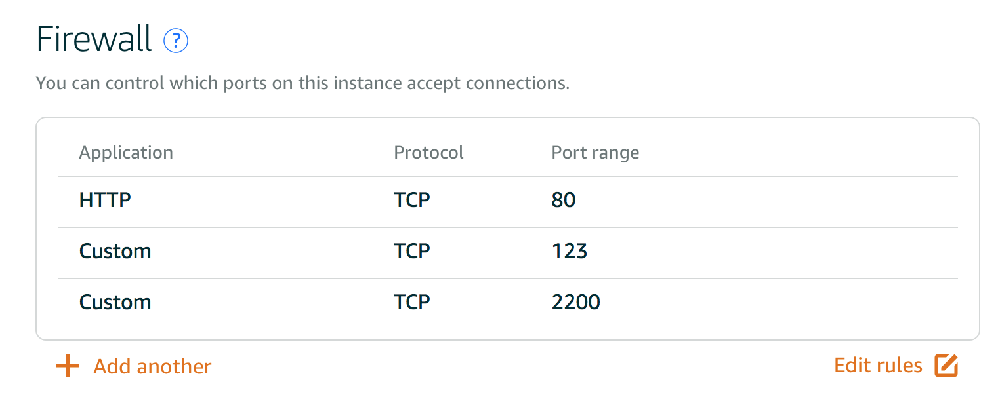
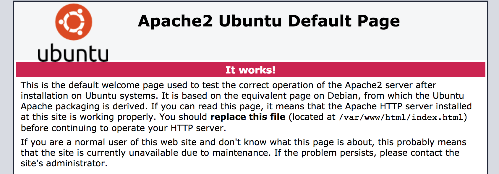
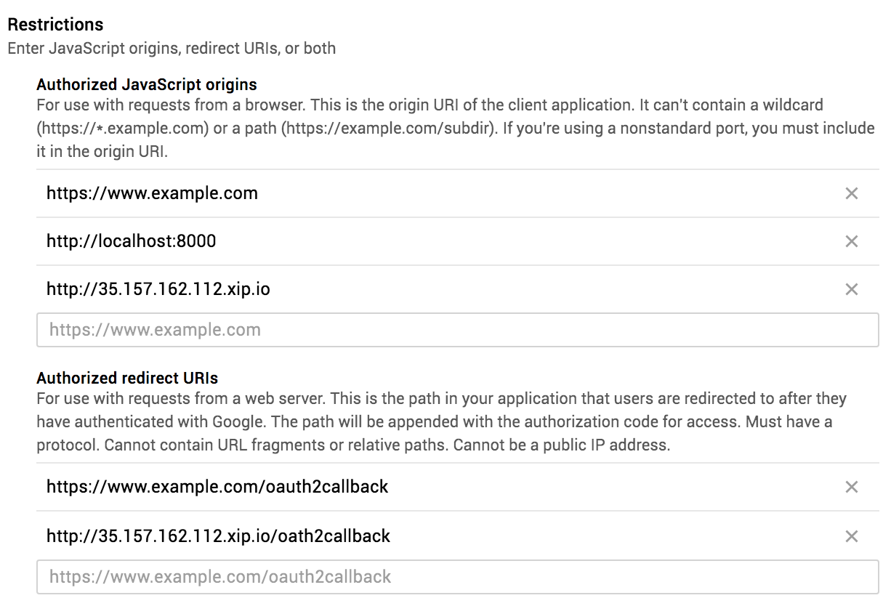
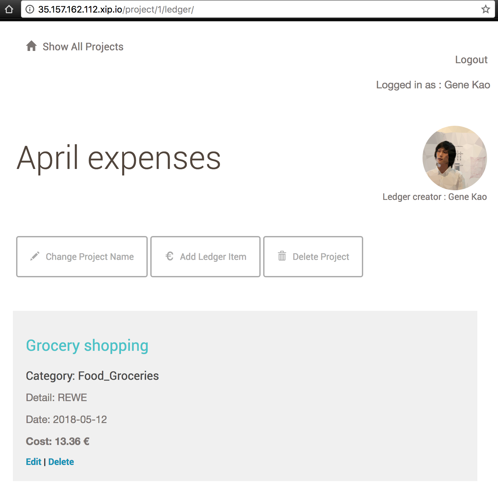

# Linux Server Configuration Using Amazon Lightsail - ledger-app 

## Udacity Full Stack Web Developer
## Project 6 - Linux Server Configuration

>by Gene Ting-Chun Kao

## Configuration Steps 

### Deploying website

http://35.157.162.112.xip.io/

After setup [Amazon
Lightsail](https://lightsail.aws.amazon.com/ls/webapp/home/instances), go to
**Networking** and make a static IP address. 

To make the OAuth works in my ledger application. We need to have a DNS refers
to IP address, so I used [xip.io](http://xip.io/).


### Update all packages

Use `sudo apt-get` to update the packages' source. 

Then use `sudo apt-get upgrade` or `sudo apt-get dist-upgrade` to upgrade all
packages.


### Install extra packages

`sudo apt-get install emacs24-nox` Install
[Emacs](https://www.gnu.org/software/emacs/), because it is the best editor in
the world! And [Emacs rocks](http://emacsrocks.com/).


### SSH to the server

First, we make SSH key pair because using our own terminal to in the remote Linux
machine is much more comfortable. 

We use `ssh-keygen` in our **local machine** to generate our public and
private keys. For example, we will have `aws.pub` and `aws`. In default, it is
created in `~/.ssh` directory. 

`cat ~/.ssh/aws.pub` and copy the public key. 

Then SSH to the Linux machine through AWS browser terminal interface, create
**authorized_keys** in `~/.ssh` by typing `mkdir ~/.ssh && touch
authorized_keys`, and paste your public key into the file. 

change the permission

``` shell
$ chmod 700 .ssh
$ chmod 644 .ssh/authorized_keys

$ service ssh restart
```

Now we can log in to remote server from our local terminal! 

``` shell
$ ssh ubuntu@35.157.162.112 -p 22 -i ~/.ssh/aws
```

### Configure the Uncomplicated Firewall (UFW)

Firs, let's configure the AWS **Networking** settings. 



In the remote server 

``` shell
$ sudo ufw default deny incoming
$ sudo ufw default allow outgoing
$ sudo ufw allow 2200/tcp
$ sudo ufw allow www 
$ sudo ufw allow 123/udp               # this allow port 123 for ntp.
$ sudo ufw enable
```

To remove the rules. refer to this
[site](https://www.digitalocean.com/community/tutorials/how-to-set-up-a-firewall-with-ufw-on-ubuntu-14-04). 

``` shell
$ sudo ufw status numbered
$ sudo ufw delete 2                    # 2 is the number you would like to delete. 
```


By typing `sudo ufw status`, we should now see some firewall status. 

``` shell
To                         Action      From
--                         ------      ----
2200/tcp                   ALLOW       Anywhere
80/tcp                     ALLOW       Anywhere
123/udp                    ALLOW       Anywhere
2200/tcp (v6)              ALLOW       Anywhere (v6)
80/tcp (v6)                ALLOW       Anywhere (v6)
123/udp (v6)               ALLOW       Anywhere (v6)
```

Now we should be able to re-login to the server with different SSH port **2200**. 

``` shell
$ ssh ubuntu@35.157.162.112 -p 2200 -i ~/.ssh/aws
```


### Create a reviewer's account *grader*

``` shell
$ sudo adduser grader                   # Add a user called grader. 
$ sudo cp /etc/sudoers.d/90-cloud-init-users /etc/sudoers.d/grader
$ sudo emacs /etc/sudoers.d/grader      # And change line 4 to grader ALL=(ALL) NOPASSWD:ALL
```

And repeat the `ssh-keygen` process like before. 

`ssh grader@35.157.162.112 -p 2200 -i ~/.ssh/grader`


### Configure the local timezone to UTC

Type `sudo dpkg-reconfigure tzdata` and choose **None of the above** -> **UTC**.


### Install and configure Apache to serve a Python3 mod_wsgi application

``` shell
$ sudo apt-get install apache2
$ sudo apt-get install libapache2-mod-wsgi-py3
```

We should be able to see Apache working.




### Install and configure PostgreSQL

`$ sudo apt-get install postgresql` 

By default, PostgreSQL don't allow remote connection. Check
`/etc/postgresql/9.5/main/pg_hba.conf` to make sure that. 


To create a new database user named catalog, first login as postgres `sudo su -
postgres`, then `psql` to enter the database. 

``` shell
postgres=# CREATE DATABASE catalog;
postgres=# CREATE USER catalog;
postgres=# ALTER ROLE catalog WITH PASSWORD 'password';
postgres=# GRANT ALL PRIVILEGES ON DATABASE catalog TO catalog;
```


### Install git

By default, git is already install. If not `sudo apt-get install git`. 


### Deploy the ledger-app 

``` shell
$ cd /var/www/ && mkdir flaskApp && cd flaskApp

# Do not have "-" in the name, otherwise, python from...import doesn't work. 
$ sudo git clone https://github.com/GeneKao/ledger-app.git ledgerapp
$ sudo git checkout aws-deploy
```

Don't forget to download your own google OAuth API key and place it as
client_secrets.json in the *ledgerapp* directory. 

I created a different branch with minor code changes, to see the difference, go to
this
[commit](https://github.com/GeneKao/ledger-app/commit/ad27420f87e5be09a6f78ddbba92deb6090a07cf)
in the [aws-deploy
branch](https://github.com/GeneKao/ledger-app/tree/aws-deploy). 

To config [Google Cloud Platform](https://console.cloud.google.com/) make sure
you put url to restrictions. 




### Using virtualenv to run the code. 

``` shell
$ cd /var/www/flaskApp/ledgerapp

# Install pip and virtualenv
$ sudo apt-get install python3-pip
$ sudo apt-get install python-virtualenv

$ sudo virtualenv -p python3 env
$ sudo chown -R grader:grader env/
$ source ./env/bin/activate 
$ pip install flask packaging oauth2client redis passlib flask-httpauth
$ pip install sqlalchemy flask-sqlalchemy psycopg2-binary bleach requests

# To run the code
$ python models.py    # Set up database schema. 
$ python __init__.py  # To test if the code is running, then Ctrl-C to go out. 

```

References:
- https://github.com/googlesamples/assistant-sdk-python/issues/236
- http://flask.pocoo.org/docs/0.12/installation/


### Setup WSGI application

First disable apache default application. 

``` shell
sudo a2dissite 000-default.conf
```

Change setting in `/etc/apache2/mods-enabled/wsgi.conf` to use python3. 

``` shell
#WSGIPythonPath directory|directory-1:directory-2:...
WSGIPythonPath /var/www/flaskApp/ledgerapp/env/lib/python3.5/site-packages
```

Create `/etc/apache2/sites-available/ledgerapp.conf` to enable Apache render
ledgerapp. 

``` shell
<VirtualHost *:80>
	ServerName 18.184.36.243
	WSGIScriptAlias / /var/www/flaskApp/ledgerapp.wsgi
	<Directory /var/www/flaskApp/ledgerapp/>
	    Order allow,deny
	    Allow from all
    </Directory>
    Alias /static /var/www/flaskApp/ledgerapp/static
    <Directory /var/www/flaskApp/ledgerapp/static/>
        Order allow,deny
        Allow from all
    </Directory>
    ErrorLog ${APACHE_LOG_DIR}/error.log
    LogLevel warn
    CustomLog ${APACHE_LOG_DIR}/access.log combined
</VirtualHost>
```

Enable ledgerapp

``` shell
$ sudo a2ensite ledgerapp
$ sudo service apache2 reload
```

Create `/var/www/flaskApp/ledgerapp.wsgi` to connet to flask and virtualenv.

``` shell
activate_this = '/var/www/flaskApp/ledgerapp/env/bin/activate_this.py'
with open(activate_this) as file_:
    exec(file_.read(), dict(__file__=activate_this))

#!/usr/bin/python
import sys
import logging
logging.basicConfig(stream=sys.stderr)
sys.path.insert(0, "/var/www/flaskApp/ledgerapp")
sys.path.insert(1, "/var/www/flaskApp/")

from ledgerapp import app as application
application.secret_key = "super_secret_key"
```

Restart Apache HTTP server whenever we modify some server-side code. 

``` shell
$ sudo service apache2 restart
```

References: 

- http://flask.pocoo.org/docs/0.12/deploying/mod_wsgi/#working-with-virtual-environments
- https://stackoverflow.com/questions/30642894/getting-flask-to-use-python3-apache-mod-wsgi
- https://www.digitalocean.com/community/tutorials/how-to-deploy-a-flask-application-on-an-ubuntu-vps
- https://stackoverflow.com/questions/47736881/running-flask-with-mod-wsgi-through-virtualenv
- https://www.jakowicz.com/flask-apache-wsgi/


### Finish!

Now we should be able to see the website in public! Yeah!




### Folder tree

``` shell
$ sudo apt-get install tree
$ sudo tree -L 3 /var/www/flaskApp/

/var/www/flaskApp/
├── ledgerapp
│   ├── client_secrets.json
│   ├── env
│   │   ├── bin
│   │   ├── include
│   │   ├── lib
│   │   ├── pip-selfcheck.json
│   │   └── share
│   ├── images
│   │   ├── AddLedger.png
│   │   ├── LedgersJSON.png
│   │   ├── Ledgers.png
│   │   ├── ProjectsJSON.png
│   │   └── Projects.png
│   ├── __init__.py
│   ├── models.py
│   ├── models.pyc
│   ├── __pycache__
│   │   ├── __init__.cpython-35.pyc
│   │   └── models.cpython-35.pyc
│   ├── README.md
│   ├── static
│   │   └── styles.css
│   └── templates
│       ├── deleteLedgerItem.html
│       ├── deleteProject.html
│       ├── editLedgerItem.html
│       ├── editProject.html
│       ├── header.html
│       ├── ledger.html
│       ├── login.html
│       ├── main.html
│       ├── newLedgerItem.html
│       ├── newProject.html
│       ├── projects.html
│       ├── publicLedger.html
│       └── publicProject.html
└── ledgerapp.wsgi

10 directories, 28 files
```

### How to debug by checking the log files

``` shell
$ sudo cat /var/log/apache2/error.log
$ sudo cat /var/log/apache2/access.log
```

### Tips: Restart PostgreSQL before dropping it. 

``` shell
$ sudo service postgresql restart 
# then type "DROP DATABASE catalog;" in psql. 

```


